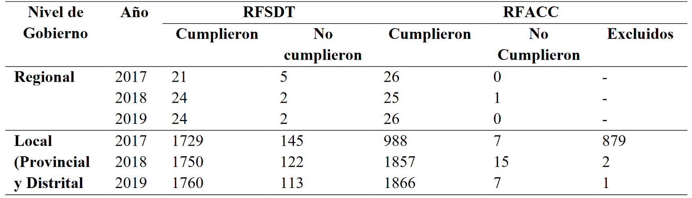
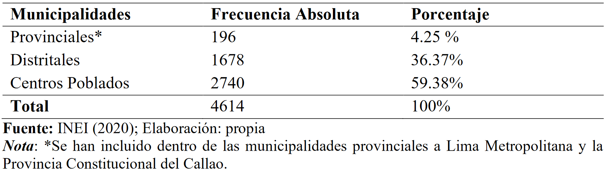
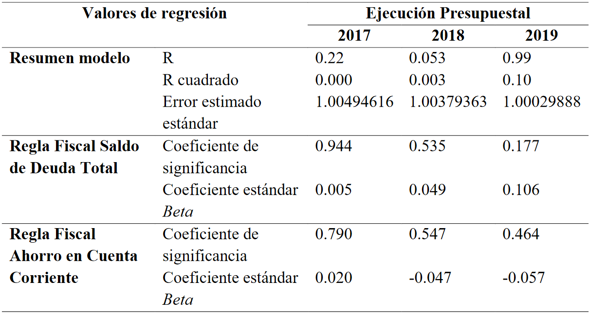
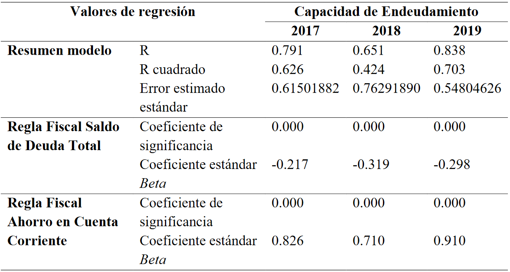
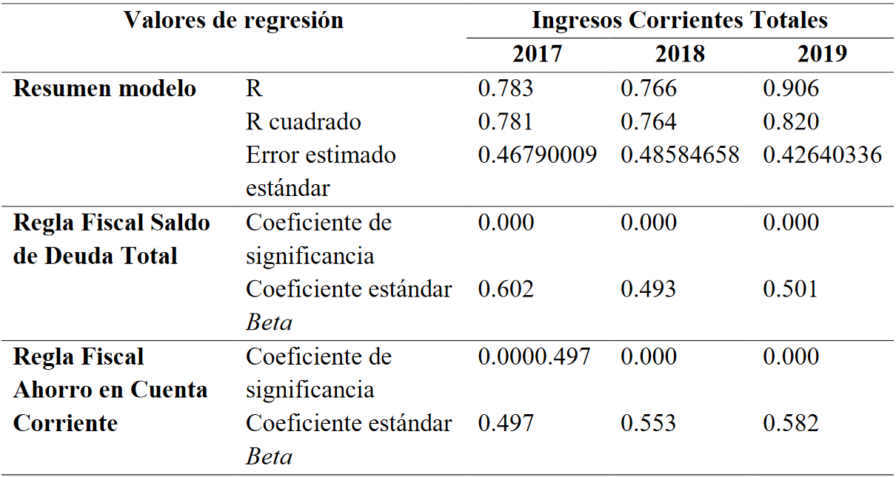

---
output:
  xaringan::moon_reader:
    css: [rutgers-fonts, robot]
    nature:
      highlightStyle: github
      highlightLine: true
      countIncrementalSlides: true
      ratio: "16:9"
---
layout:true 

background-image: url(https://i.ibb.co/3Wx5t37/Fondo-tesis.png)
background-size: 1217px
background-position: 100% 100%

---
background-image: url(https://i.ibb.co/ysJJ0hX/caratula.png)

---
background-image: url(https://i.ibb.co/dLYYSQ2/Estructura.png)

---
background-image: url(https://i.ibb.co/mCh5G2L/Intro.png)

---
background-image: url(https://i.ibb.co/gw6bgxC/Realidad.png)

---
background-image: url(https://i.ibb.co/NZxTYHr/marco1.png)

---

# **1.4. Marco Teórico Conceptual 2/2**

**5. Reglas Fiscales para gobiernos subnacionales**

Existen las siguientes:
- SDT  que es la regla de Saldo de Deuda Total. 

$$\frac{SDT año}{ICT_{Prom 2016-año}}\ \leq 100%$$

- ICT que es la regla de Ingreso Corriente Total o Ahorro en Cuenta Corriente
$$ICT_{año} = GCNF_{2019} \geq 0$$

**6. Gestión Pública**

Capacidad institucional que tienen las municipalidades de ejecutar sus actividades planificadas.

---

# **1.5. Marco Empírico 1/2**

**1. Uso de las Reglas Fiscales en el Perú**
- ***Aplicación de Reglas Fiscales en GR y GL, 2017-2019***
```{r echo=FALSE, out.width = "780px", out.height="250px",fig.align='center'}


```

**2. Evaluación de la Gestión Pública en el Perú**

- Contexto de descentralización. 

- Marco de Modernización del Estado. 

---
background-image: url(https://i.ibb.co/dG8d5Mf/marco6.png)

---
background-image: url(https://i.ibb.co/j6y0P6R/Pregunta.png)

---
background-image: url(https://i.ibb.co/gWx9PbN/objetivos.png)

---
background-image: url(https://i.ibb.co/QPNVqL0/Hipo.png)

---
background-image: url(https://i.ibb.co/fXKhJ93/methods.png)

---
background-image: url(https://i.ibb.co/5cmkh3L/tipo.png)

---
class: middle
# **2.3 Operacionalización de las Variables**

```{r, echo=FALSE, message=FALSE}
library(dplyr)
library(kableExtra)

collapse_rows_dt <- data.frame(Variable = c(rep("Reglas Fiscales Subnacionales", 2), rep("Gestión Pública Local", 3)),
                 "Definición_Conceptual" = c(rep("Son instrumentos de política fiscal destinadas a asegurar la estabilidad macroeconómica a través de límites de gasto y de medición de ingresos corrientes.", 2), rep("Es la capacidad institucional que tienen las municipalidades de ejecutar las actividades que planifican manteniendo un buen estado financiero.", 3)),
                 Dimensiones = c(rep("Saldo de Deuda Total",1), rep("Ahorro en Cuenta Corriente",1), rep("Planificación",1), rep("Capacidad de Financiamiento",1), rep(" ",1)),
                 Indicadores = c("Cantidad en soles del Saldo de Deuda Total", "Cantidad en soles del Ahorro en Cuenta Corriente", "Porcentaje de Ejecución Presupuestal", "Cantidad en Soles de los Ingresos Corrientes Totales", "Cantidad en soles de la Capacidad de Endeudamiento"))
 kbl(collapse_rows_dt, align = "c") %>%
  kable_paper(full_width = F) %>%
  column_spec(1, bold = T) %>%
  collapse_rows(columns = 1:2, valign = "middle") %>%
   kable_styling(full_width = F, font_size = 19)
```
---
background-image: url(https://i.ibb.co/ZBZ6tKT/results.png)

---

# **3.1 Gobiernos Locales en el Perú**

<br>

- ***Distribución porcentual de las municipalidades provinciales del Perú***

<br>

```{r echo=FALSE, out.width = "800px", out.height="250px",fig.align='center'}



```

---

# **3.2 Reglas Fiscales y Ejecución Presupuestal**

- ***Valores de regresión entre Reglas Fiscales y Ejecución Presupuestal***
<br>

```{r echo=FALSE, out.width = "680px", out.height="350px",fig.align='center'}



```
<br>
***Análisis:*** La variable ejecución presupuestal es sensible a muchos factores adicionales a la misma política económica. En ese sentido, la fortaleza institucional o su ausencia, son un factor explicativo importante. 

---

# **3.3 Reglas Fiscales y Capacidad de Endeudamiento**

- ***Valores de regresión entre Reglas Fiscales y Capacidad de Endeudamiento***
<br>

```{r echo=FALSE, out.width = "680px", out.height="350px",fig.align='center'}



```
<br>
***Análisis:*** Fuerte correlación explicado por el ámbito de su aplicación de carácter especializado. 

---


# **3.4 Reglas Fiscales y los Ingresos Corrientes Totales**

- ***Valores de regresión entre Reglas Fiscales e Ingresos Corrientes Totales***
<br>

```{r echo=FALSE, out.width = "580px", out.height="330px",fig.align='center'}



```
<br>
***Análisis:*** Fuerte correlación explicada por el ámbito especializado de su aplicación. Las áreas que revisan los informes sobre RF, pueden advertir un mal desempeño de estas y corregir oportunamente. Son, además, áreas claves de las municipalidades.

---
background-image: url(https://i.ibb.co/nLQjh34/conclusions.png)

---
class: my-one-page-font

# **4.1 Conclusiones**

1. El efecto de las reglas fiscales sobre la ejecución presupuestal, no es significativo. 

1. El efecto de las reglas fiscales sobre la capacidad de endeudamiento de las municipalidades, es significativa positiva. 

1. El efecto de las reglas fiscales sobre los ingresos corrientes totales de las municipalidades, es significativa positiva.

1. De forma general, los efectos de las reglas fiscales sobre la gestión pública son significativos siempre que los atributos de esta última variable se encuentren dentro de la misma área de especialización de las Reglas Fiscales. 

1. Los efectos sobre atributos económicos especializados evidencia la postura teórica de que las reglas fiscales, incluso de nivel subnacional, fortalece la estabilidad macroeconómica nacional. 

---
background-image: url(https://i.ibb.co/yf1CDRG/reco.png)

---
background-image: url(https://i.ibb.co/M1CkDyt/biblio.png)


---
# **5.1 Bibliografía Destacada**

+ Altunbas,  Y.,  y  Thornton,  J. (2015) Why  do  countries  adopt  Fiscal Rules?

+ Chamorro Narváez, R. A. y Urrea Bermúdez, A. F. (2016) Incidencia de las reglas fiscales en  la  sostenibilidad  de  la  deuda  pública  territorial  en Colombia. 

+ Consejo  Fiscal  (s.f.)  Municipalidades,  eficiencia  del  gasto  y  clústeres  geográficos: Evaluación del gasto público a nivel municipal, Perú 2011- 2014. 

+ Decreto Legislativo N° 1275  – Marco de la Responsabilidad  y  Transparencia Fiscal  de los Gobiernos Regionales Y Gobiernos Locales. (2016). 

+ Kopits, G., y Symansky, S. (1998) Fiscal Policy Rules. 

+ North,  D.  (1995)  Instituciones,  Cambio  Institucional  y  Desempeño  Económico

+ Park,  S.  (2019)  The  Impact  of  State-imposed  Fiscal  Rules  on  Municipal  Government Fiscal Outcomes: Does Institutional Configuration Matter?.

+ Wyplosz, C. (2011) Fiscal Discipline: Rules Rather than Institutions. 

---
background-image: url(https://i.ibb.co/S6RjWsG/Fin-Pres.png)