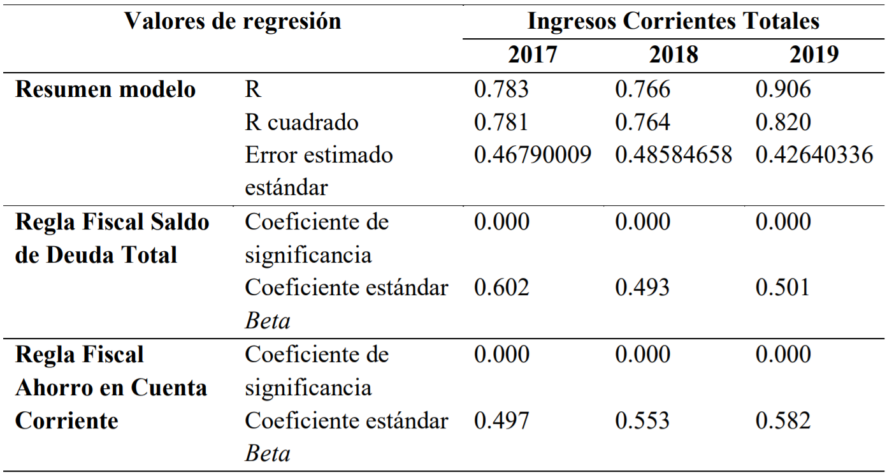

---
output:
  xaringan::moon_reader:
    css: [rutgers-fonts, robot]
    nature:
      highlightStyle: github
      highlightLine: true
      countIncrementalSlides: true
      ratio: "16:9"
---
layout:true 

background-image: url(https://upload.wikimedia.org/wikipedia/commons/6/6e/Universidad_Nacional_de_Trujillo_-_Per%C3%BA_vector_logo.png)
background-size: 100px
background-position: 90% 8%

---
class: middle, center, inverse
background-position: 50% 37%
background-size: 220px


**Universidad Nacional de Trujillo**

**E.A.P. Ciencia Política y Gobernabilidad**

<br>
<br>
<br>
<br>
<br>

# "Las Reglas Fiscales y sus Efectos en la Gestión Pública de las Municipalidades Provinciales en el Perú en el 2017-2019"
##### Tesis para optar el título profesional en Ciencia Política y Gobernabilidad

Bach. Lino Cruz

---
# Estructura de la Presentación
### 1. Introducción

#### 1.1. Realidad Problemática
#### 1.2. Justificación y Relevancia
#### 1.3. Marco Teórico Conceptual
#### 1.4. Marco Empírico

### 2. Procedimiento Metodológico

### 3. Resultados y Análisis

### 4. Conclusiones

---

# Introducción

--

### **Realidad Problemática**
- Posibilidad de una recesión económica.

- Estabilidad macroeconómica nacional y subnanacional.

- Marco de la Responsabilidad y Transparencia Fiscal en los Gobiernos Regionales y Locales (DL. N° 1275/2016)

- Gestión Pública.

--

### **Justificación y Relevancia**
- Proponer un nuevo marco de análisis con elementos de la ciencia política. 

- Conocimientos para mejorar la gestión pública en su componente económico.

---
# Marco Teórico Conceptual 1/2

--
#### 1. Teoría Institucional
Las instituciones son el conjunto de reglas formales e informales. (North, 1990)

--
#### 2. Municipalidad
Entidad de gobierno de nivel local o subnacional.

--
#### 3. Políticas Económicas
Medidas de carácter económico en busca del equilibrio entre los agentes económicos de un país o región. 

--
#### 4. Reglas Fiscales
Instrumentos fiscales de carácter instrumental que establecen límites para lograr la estabilidad macroeconómica. 

---
# Marco Teórico Conceptual 2/2

**5. Reglas Fiscales para gobiernos subnacionales**

Existen las siguientes:
- SDT  que es la regla de Saldo de Deuda Total. 

$$\frac{SDT año}{ICT_{Prom 2016-año}}\ \leq 100%$$

- ICT que es la regla de Ingreso Corriente Total o Ahorro en Cuenta Corriente
$$ICT_{año} = GCNF_{2019} \geq 0$$

**6. Gestión Pública**

Capacidad institucional que tienen las municipalidades de ejecutar sus actividades planificadas.

---

# Marco Empírico 1/2

1. **Uso de las Reglas Fiscales en el Perú**
- ***Aplicación de Reglas Fiscales en GR y GL, 2017-2019***
```{r echo=FALSE, out.width = "800px", out.height="250px",fig.align='center'}

knitr::include_graphics("RF General.png")
```

1. **Evaluación de la Gestión Pública en el Perú**

- Contexto de descentralización. 

- Marco de Modernización del Estado. 

---
# Marco Empírico 2/2
<br>

### 3. Efectos de las Reglas Fiscales en diversas áreas de la administración pública

- Fuerte relación entre el diseño de las RF y mejores resultados presupuestales. (Tapp, 2013; Jiménez y Ter-Minassian, 2016; Wang, 2016)

- Su cumplimiento depende de las sanciones al incumplimiento.(Smith, 2016)

- Las RF subnacionales favorecen la estabilidad macroeconómica nacional.(Consejo Fiscal,s.f.; Chamorro Narváez y Urrea Bermúdez, 2016)

- Las RF tienen un aporte positivo al manejo fiscal discrecional; pero, también pueden tener costos sociales. (Gehrke, 2014)

---
class: center, middle, inverse

# Problema de Investigación

¿Cuáles son los efectos de las reglas fiscales en la gestión pública de las municipalidades provinciales del Perú durante el periodo 2017-2019?

# Objetivo

Determinar  los  efectos  de las reglas  fiscales  en  la gestión pública  local  de  las municipalidades provinciales del Perú durante el periodo 2017 - 2019. 

---
class: large

<br>
<br>
# Objetivos Específicos
<br>
- Identificar el efecto que tienen las reglas fiscales sobre la ejecución presupuestal  de las municipales provinciales del Perú durante el periodo 2017 - 2019. 

<br>

- Conocer el efecto que tienen las reglas fiscales sobre la capacidad de endeudamiento de las municipales provinciales del Perú durante el periodo 2017 - 2019.

<br>

- Determinar los efectos de las reglas fiscales  en los ingresos corrientes totales de las municipalidades provinciales del Perú en el periodo 2017 - 2019.

---
#Hipótesis

--
### General
- H0: Las reglas fiscales tienen efectos significativos en la gestión pública de las municipalidades provinciales del Perú durante el periodo 2017-2019.

--
### Específicas
- H1: Las reglas fiscales tienen una relación signifcativa con la ejecución presupuestal de las municipalidades provinciales del Perú durante el periodo 2017-2019.

- H2: Las reglas fiscales tienen una relación significativa con la capacidad de endeudamiento de las municipalidades provinciales del Perú durante el periodo 2017-2019. 

- H3: Las reglas fiscales tienen una relación significativa con los ingresos corrientes totales de las municipalidades provinciales del Perú durante el periodo 2017-2019.
---
class: middle, center, inverse

# Metodología

---
# Tipo de Investigación 

- Enfoque Cuantitativo

- No experimental

- Longitudinal

- Análisis de nivel Descriptivo-correlacional

--
# Procedimiento metodológico


1. Descripción de las variables de estudio.

1. Preparación de los datos y elección de los modelos estadísticos a aplicar. 

1. Aplicación y procesamiento de los datos. 

1. Análisis de los resultados. 

---
class: middle
# Operacionalización de las Variables

```{r, echo=FALSE, message=FALSE}
library(dplyr)
library(kableExtra)

collapse_rows_dt <- data.frame(Variable = c(rep("Reglas Fiscales Subnacionales", 2), rep("Gestión Pública Local", 3)),
                 "Definición_Conceptual" = c(rep("Son instrumentos de política fiscal destinadas a asegurar la estabilidad macroeconómica a través de límites de gasto y de medición de ingresos corrientes.", 2), rep("Es la capacidad institucional que tienen las municipalidades de ejecutar las actividades que planifican manteniendo un buen estado financiero.", 3)),
                 Dimensiones = c(rep("Saldo de Deuda Total",1), rep("Ahorro en Cuenta Corriente",1), rep("Planificación",1), rep("Capacidad de Financiamiento",1), rep(" ",1)),
                 Indicadores = c("Cantidad en soles del Saldo de Deuda Total", "Cantidad en soles del Ahorro en Cuenta Corriente", "Porcentaje de Ejecución Presupuestal", "Cantidad en Soles de los Ingresos Corrientes Totales", "Cantidad en soles de la Capacidad de Endeudamiento"))
 kbl(collapse_rows_dt, align = "c") %>%
  kable_paper(full_width = F) %>%
  column_spec(1, bold = T) %>%
  collapse_rows(columns = 1:2, valign = "middle") %>%
   kable_styling(full_width = F, font_size = 17)
```
---
class: inverse, middle, center

# Resultados y Análisis

---
# Gobiernos Locales en el Perú

<br>

- ***Distribución porcentual de las municipalidades provinciales del Perú***

<br>

```{r echo=FALSE, out.width = "800px", out.height="250px",fig.align='center'}


```

---
background-position: 95% 8%
# Reglas Fiscales y Ejecución Presupuestal

- ***Valores de regresión entre Reglas Fiscales y Ejecución Presupuestal***
<br>

```{r echo=FALSE, out.width = "680px", out.height="350px",fig.align='center'}

knitr::include_graphics("RF_EJE.png")

```
<br>
***Análisis:*** La variable ejecución presupuestal es sensible a muchos factores adicionales a la misma política económica. En ese sentido, la fortaleza institucional o su ausencia, son un factor explicativo importante. 

---
# Reglas Fiscales y Capacidad de Endeudamiento

- ***Valores de regresión entre Reglas Fiscales y Capacidad de Endeudamiento***
<br>

```{r echo=FALSE, out.width = "680px", out.height="350px",fig.align='center'}

knitr::include_graphics("RF_END.png")

```
<br>
***Análisis:*** Fuerte correlación explicado por el ámbito de su aplicación de carácter especializado. 

---
background-position: 95% 8%

# Reglas Fiscales y los Ingresos Corrientes Totales

- ***Valores de regresión entre Reglas Fiscales e Ingresos Corrientes Totales***
<br>

```{r echo=FALSE, out.width = "680px", out.height="350px",fig.align='center'}



```
<br>
***Análisis:*** Fuerte correlación explicada por el ámbito especializado de su aplicación. Las áreas que revisan los informes sobre RF, pueden advertir un mal desempeño de estas y corregir oportunamente. Son, además, áreas claves de las municipalidades.
---
class: middle, my-one-page-font

# Conclusiones

1. El efecto de las reglas fiscales sobre la ejecución presupuestal, no es significativo. 

1. El efecto de las reglas fiscales sobre la capacidad de endeudamiento de las municipalidades, es significativa positiva. 

1. El efecto de las reglas fiscales sobre los ingresos corrientes totales de las municipalidades, es significativa positiva.

1. De forma general, los efectos de las reglas fiscales sobre la gestión pública son significativos siempre que los atributos de esta última variable se encuentren dentro de la misma área de especialización de las Reglas Fiscales. 

1. Los efectos sobre atributos económicos especializados evidencia la postura teórica de que las reglas fiscales, incluso de nivel subnacional, fortalece la estabilidad macroeconómica nacional. 

---
background-size: 170px
class: middle, my-one-page-font

# Recomendaciones


--

- Estudiar un periodo más largo de tiempo de aplicación de las mismas reglas fiscales en enfoque de series temporales. 


--

- Considerar un número mayor de atributos de la variable gestión pública, en especial para la dimensión de planificación. Si es de enfoque mixto, los atributos pueden ser cualitativos y cuantitativos.  


--

- Abarcar, en estudios de tipo de analítica de datos, datos sobre las municipalidades de nivel distrital. 


---
class: center, inverse, middle
background-position: 50% 20% 
background-size: 300px

##### Tesis dedicada a mi abuelita, mi familia, la universidad y a mi asesora, la Dra.Bautista Zúñiga.